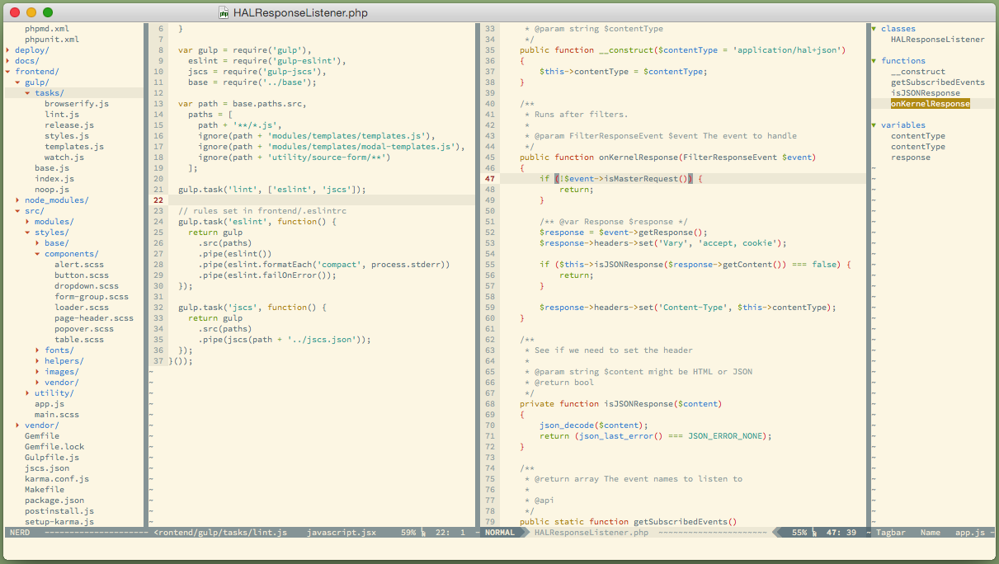

MacVim / vim config
 http://github.com/lsd/vim
 Updated 01/26/2013
 Note This is WORK IN PROGRESS
===
~/.vimrc and ~/.vim directories. I use MacVim but this setup should be OS-agnostic.
Extraneous buffers are enabled in MacVim but not console vim, for which toggle keys 
exist to open up NERDTree, Taglist, MiniBuffexplorer, etc.

DEPENDENCIES
===
This config uses (and includes) NeoBundle for plugin management.
For manual installation, remove bundle/neobundle.vim
from the repo and follow the instructions on
https://github.com/Shougo/neobundle.vim

SCREENSHOT
===

INSTALLATION
===
Clone repo, symlink ~/.vimrc to repo/vimrc and ~/.vim to repo

Install the Inconsolata font in the fonts dir or remove the guifont line

For convenience, I've included the plugins in the bundle/ dir. These may be old!
Launch MacVim or vim and run :NeoBundleUpdate to update the enclosed plugins

CONSOLE VIM?
===
I disable the left/right sidebars when opening vim in a console. They only auto
open in MacVim because of how I use MacVim and vim. If you want these buffers
to open with vim, remove the if has("gui_running") clause

